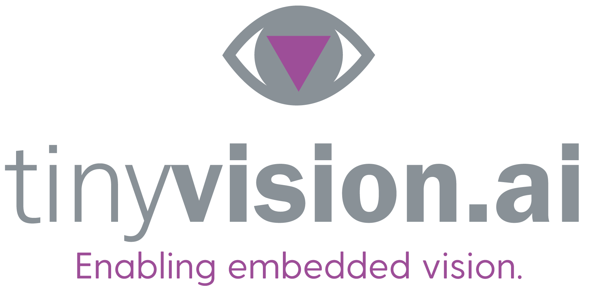
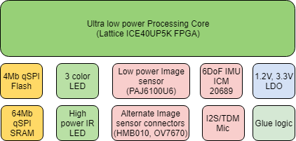

# Vision, Audio &amp; Motion FPGA SoM
## Low Power Sensing/processing System on Module

The Vision, Audio and Motion FPGA SoM enables IoT devices to see, hear and sense motion. This is a tightly integrated platform consisting of a low power image sensor, microphone and 6-DoF IMU coupled to a local computing device ([Lattice ultra low power ICE40 UltraPlus 5K FPGA](http://www.latticesemi.com/en/Products/FPGAandCPLD/iCE40UltraPlus)).

Typical applications of the SoM include image capture, trigger/capture images on motion (vision or IMU based), human face/presence detection, keyphrase detection and gestures.

The SoM is designed to be integrated into devices to enable edge computing, significantly shortening the time to market and allowing the developer to focus on their differentiation.

The module integrates the following capabilities:

- Local processing using the Lattice ICE40 Ultra Plus 5K Ultra-low-power FPGA, 5K LUT, 1Mb RAM, 8 MAC units
- Image sensor options
  - Integrated qVGA monochrome global shutter imager (Pixart PAJ6100U6)
  - Connector for color/monochrome rolling shutter imager (Himax HMB010)
  - Connector for OV7670 flex
- One MEMS I2S/TDM microphone, expandable to up to 8 microphones
- LED's
  - Tri-colour LED
  - IR LED for low light illumination with exposure synchronization
- 6 axis Gyro/accelerometer (Invensense IMU 60289)
- Memory
  - 8Mb qSPI Flash for bitstream/code storage
  - 64Mb qSPI SRAM for data
- Four GPIO, programmable IO voltage
- 4 wire SPI host interface with programmable IO voltage
- 2 power options:
  - Single 3.3V operation, can supply 1.8V and 1.2V @100mA (max) to external devices using onboard LDO
  - External 3.3V, 1.8V, 1.2V for lower power operation
- Supports the Lattice [SensAI](https://www.latticesemi.com/sensAI) toolchain using Tensorflow/Caffe/Keras for model development, quantization and mapping to the SensAI Neural Network engines.
  - Single and 8-bit neural networks
  - Models provided for face and human presence detection, gestures
  - Performance of >30 fps for inferencing at <15 mW
- [Developer kit](./SoM/SoM_devkit_details.png) enables fast prototyping of complete end applications with an on-board Wifi/BLE module, various connectors, Lipoly charger etc.

For more details, please see the [Datasheet](../resources/som_details/Sensor_FPGA_SoM_data_sheet_2.0.pdf) and [SoM specification](SoM/README.md). A 3-D PDF rendering is available [here](../resources/som_details/SoM_3D.pdf).

Modules and developer kits are available at the tinyVision.ai [store](https://tinyvision.ai/). Please contact us for questions about the module at: <sales.at.tinyvision.ai> .
